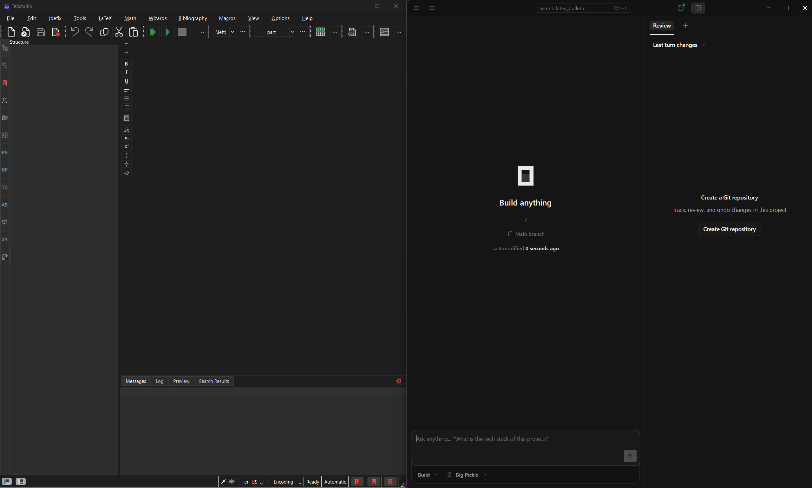
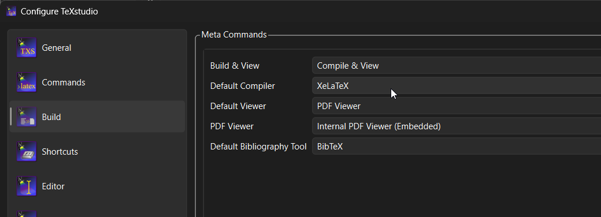

# LaTeX Bulletin

## Overview

The following document outlines a use model for creating weekly church
bulletins. The goal is to front load the process by creating solid re-usable
markdown templates, and streamline the weekly process.

AI tools will be employed to aid in the content insertion and formatting.

### Why Markdown Templates?

* Extremely re-usable
* Explicit and consistent formatting
* Easy for AI tools to understand and edit
* Easy to version control and track changes over time, or roll back if needed

## Programs (Windows)

* [TeXstudio](https://texstudio.org/) - Editor
* [MikeTeX](https://miktex.org/download) - Editor dependency
* [OpenCode Desktop](https://opencode.ai/download) - AI helper


## Set-up

### Directory Structure

The following is a description of a directory structure for organizing your
workspace. It is not required to follow this, but this document will assume
this structure.

```

```


Open Texstudio and OpenCode. I like to have
them open on two monitors or side-by-side in one monitor.



## TeXstudio


